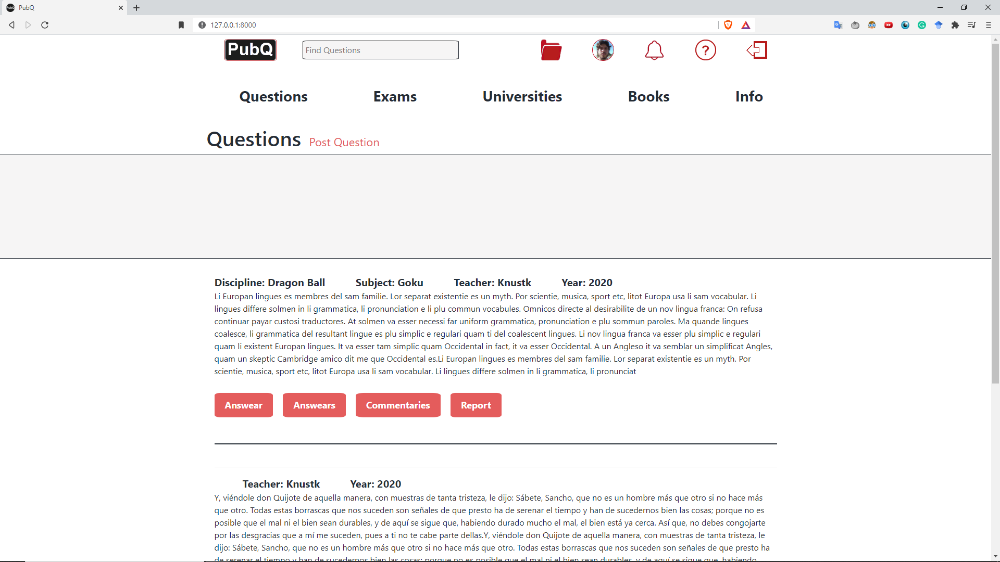
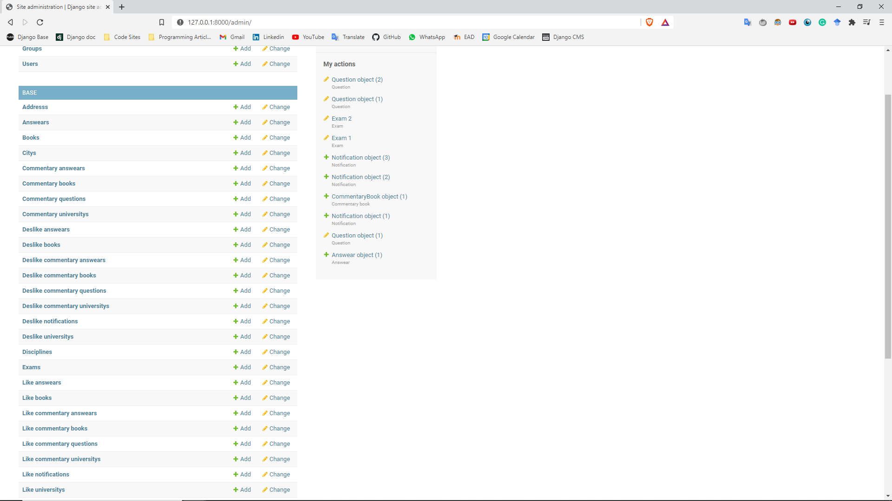

# PubQ

<p align="center">
 <a href="#Description">Description</a> •
 <a href="#Manual">How to Run it</a> • 
 <a href="#Dependencies">Dependencies</a> • 
 <a href="#Technologies">Technologies</a> • 
 <a href="#Licence">Licence</a> • 
</p>

## Warning

```diff 
- The project is still in development, but it's almost finished. 
```






## Description

PubQ is a platform to study for exams published at universities.

## Manual

First download and extract the folder, then run 'pip install -r requirements.txt' to downaload the dependencies
After this, you can run it with the command 'python manage.py runserver" and can use see the project on 'http://127.0.0.1:8000/'.

## Dependencies

Django, django-filter

## Technologies

Python, Django, Javascript, HTML/CSS, Postgre


## License
[GPL-3.0](https://www.gnu.org/licenses/gpl-3.0.en.html)
