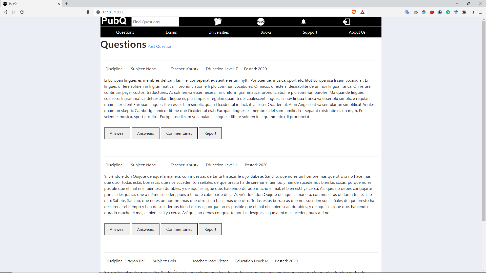
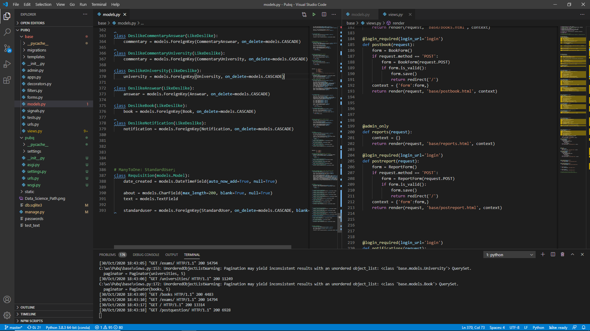

# PubQ

## Warning

```diff 
- The project is still in development and the styling of the frontend will be the last step.
```


## Description

PubQ is a platform for studying, taking exams, managing and storing questions. There, as a teacher apply your tests, build PDF with your exams, buy questions from other teachers and earn credits by posting your own questions. As a student you can study with questions that were applied in the best universities, and although they are not used again, they evaluated you as a real test of the university.

## How to Run it

First you will need to install Python 3, Django 3 and Postgre 13 in your machine , you can download Python on https://www.python.org/downloads/ , Django by following this tutorial https://www.djangoproject.com/download/ and Postgre on https://www.postgresql.org/download/

Now that you have Python and Django, download the package, extract it and get in Pubq/base with your terminal and run 'python manage.py runserver"
Then you will run the program and can use it by taping 'http://127.0.0.1:8000/' on your browser.


## Dependencies

Django, django-filter

## Technologies

Python, Django, Javascript, HTML/CSS, Postgre



## License
[GPL-3.0](https://www.gnu.org/licenses/gpl-3.0.en.html)
