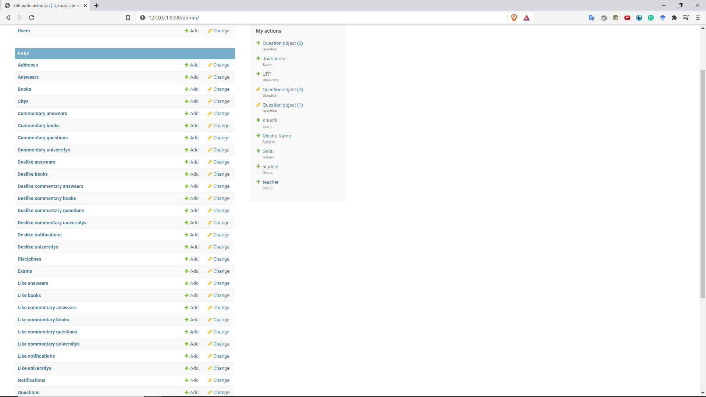

# Advertencia

```diff
- O projeto ainda está em produção e a estilização do frontend será a última etapa.
```


# PubQ

PubQ é uma plataforma para estudo, aplicação de exames, gerenciamento e armazenamento de questões, tudo 100% gratuito. Nela, como professor aplicar suas provas, baixar
PDF com as questões escolhidas, comprar questões de outros professores e ganhar créditos postando as suas próprias questões, como aluno você pode estudar com questões passaram de suas validades e não estão mais dispostas a venda.

# How to Run it

First you will need to install Python 3, Django 3 and Postgre 13 in your machine , you can download Python on https://www.python.org/downloads/ , Django by following this tutorial https://www.djangoproject.com/download/ and Postgre on https://www.postgresql.org/download/

Now that you have Python and Django, download the package, extract it and get in Pubq/base with your terminal and run 'python manage.py runserver"
Then you will run the program and can use it by taping 'http://127.0.0.1:8000/' on your browser.

# Ferramentas utilizadas

Python, Django, HTML/CSS, Postgre



