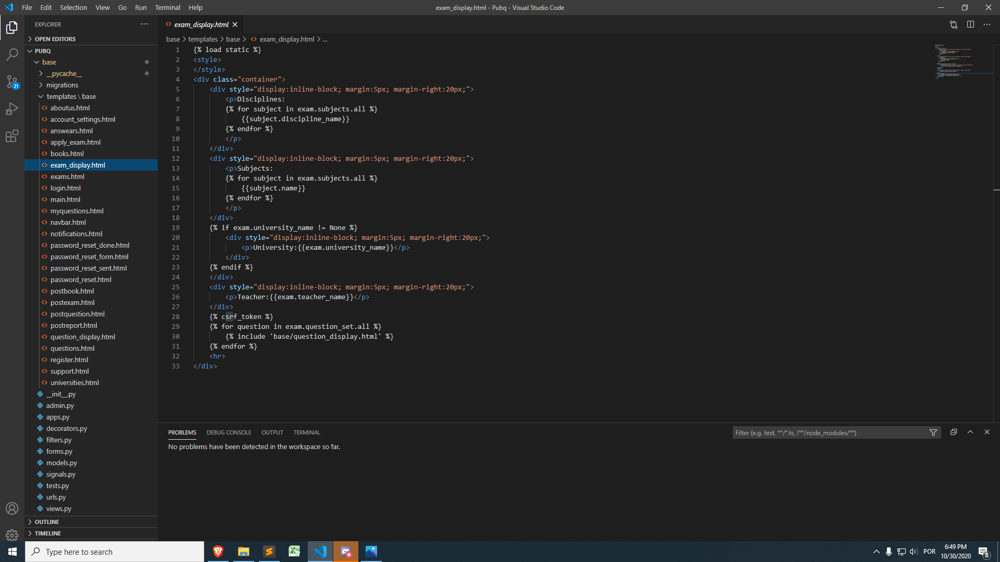

# PubQ

PubQ é uma plataforma para estudo, aplicação de exames, gerenciamento e armazenamento de questões, tudo 100% gratuito. Nela, como professor aplicar suas provas, baixar
PDF com as questões escolhidas, comprar questões de outros professores e ganhar créditos postando as suas próprias questões, como aluno você pode estudar com questões passaram de suas validades e não estão mais dispostas a venda.

# Ferramentas utilizadas

Python, Django, HTML/CSS, Postgre

# Advertencia

O projeto ainda está em produção, portanto, a parte visual ainda não foi modelada.
